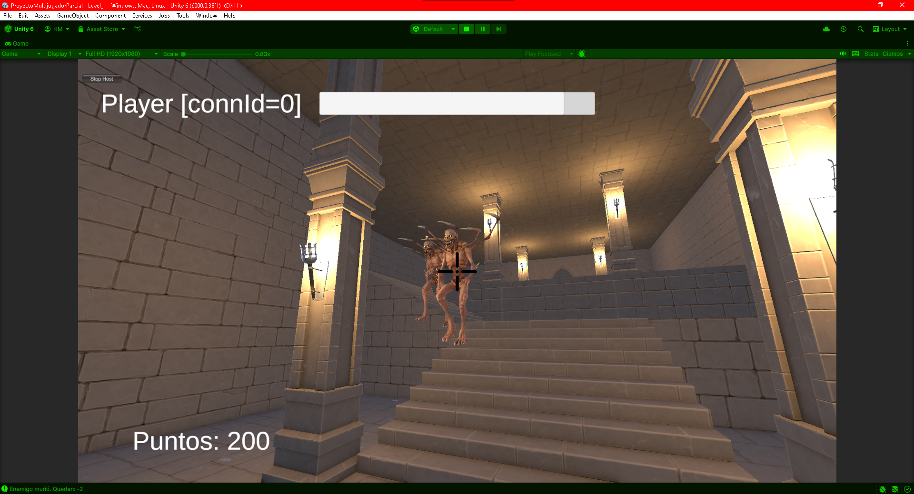
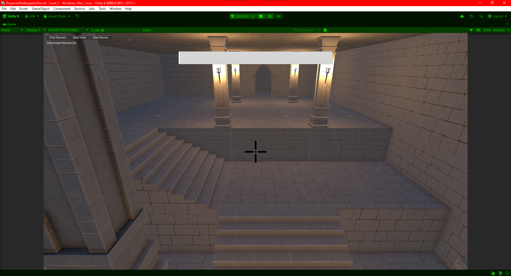

# Survival Demons COOP

**Survival Demons COOP** es un juego multijugador cooperativo tipo *shooter*, donde los jugadores deben trabajar en equipo para sobrevivir oleadas infinitas de demonios. El juego cuenta con un sistema de reaparición, control de oleadas y puntuaciones individuales.

---

## Características del juego

- Juego multijugador cooperativo usando **Mirror**.
- Sistema de oleadas con enemigos generados aleatoriamente en diferentes puntos del mapa.
- Score individual por eliminar enemigos.
- Mecánica de daño por contacto enemigo.
- Animaciones sincronizadas para jugadores y enemigos.
- UI individual por jugador que muestra vida, nombre y puntuación.
- Sistema de respawn automático después de morir.

---

## Organización de conexión de red

| Elemento                  | Configuración                                             |
|---------------------------|-----------------------------------------------------------|
| Tipo de red               | Host / Client                                             |
| Transporte de red         | KCP (por defecto de Mirror)                              |
| Librerías utilizadas      | Mirror, Unity Toolkit de multiventanas en editor         |
| Gestión de red            | `NetworkManager` con prefabs asignados para Player y Enemigos |
| Sincronización de datos   | `SyncVar`, `Command`, `ClientRpc` y `NetworkTransform`    |

- El **host** es responsable de iniciar la partida, controlar las rondas y los enemigos.
- Cada **cliente** se conecta al host y ve su propia interfaz de usuario local.
- La sincronización de vidas, animaciones, daño y puntuación se maneja desde el servidor hacia los clientes.

---

## Sistema de juego

### Spawners y Rondas

- Hay una **lista de puntos de spawn** para enemigos.
- El sistema genera enemigos al azar en esos puntos.
- Cuando todos los enemigos de una ronda han muerto, inicia una nueva oleada.
- Las rondas escalan en dificultad al aumentar el número de enemigos.

### Enemigos

- Los enemigos se mueven hacia el jugador más cercano.
- Al acercarse demasiado, causan daño automático.
- Tienen animaciones de idle, caminar y muerte.

### Jugador

- Control básico con movimiento, rotación de cámara y disparo.
- Animaciones de idle y correr.
- Recibe daño por contacto y reaparece tras un tiempo.
- Cada kill suma puntos al score individual.

---

## Setup del proyecto

1. **Clona el repositorio**:
   ```bash
   git clone https://github.com/HyanJF/ProyectoMultijugadorParcial.git

### Vista general del gameplay



### Menú de conexión

